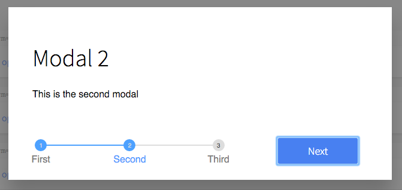

# Modal

Modal (popup) component, in fullscreen and centered-block.
Includes a Btn component for triggering the modal, and a Flow component for when there are multiple modals that follow a wizard-style of flow.



## Usage

The simplest way to use the modals is with a the `<Btn>` component, which will handle the logic for showing and hiding them.
The `<Btn>` will pass through all properties to the modal.

```jsx
import ModalBtn from 'patchkit-modal/btn'

// define the "forms" to go inside the modal:
class ModalContent1 extends React.Component {
  // ...
}
class ModalContent2 extends React.Component {
  // ...
}

// single modal
<ModalBtn Form={ModalContent1} className="fullheight" onClose={onClose}>Click to open</ModalBtn>

// modal flow
<ModalBtn Forms={[ModalContent1, ModalContent2]} className="fullheight" onClose={onClose}>Click to open</ModalBtn>
```

The `<Btn>` wraps its children in a clickable region, but adds no visual elements, so you can put custom elements inside to control its appearance:

```jsx
<ModalBtn Form={ModalContent1} className="fullheight" onClose={onClose}>
  <a className="btn highlighted">Click to open</a>
</ModalBtn>
```

However, you can use the modals directly, if you want to show/hide the modal using different logic.

```jsx
import ModalSingle from 'patchkit-modal/single'
import ModalFlow from 'patchkit-modal/flow'

<ModalSingle Form={ModalContent1} className="fullheight" onClose={onClose} isOpen={true|false} />
<ModalFlow Forms={[ModalContent1, ModalContent2]} className="fullheight" onClose={onClose} isOpen={true|false} />
```

The 'Form' should implement a `submit(cb)` function, to be called when the Modal's next/finish button is pressed.
It should also call...

 - `this.props.isValid(true|false)` to indicate whether next/finish should be clickable.
 - `this.props.isHighlighted(true|false)` to indicate whether next/finish should be highlighted blue or not.
 - `this.props.setHelpText(str)` to set some help-text at the bottom of the modal.

Example:

```jsx
class ModalForm extends React.Component {
  constructor(props) {
    super(props)
    this.state = { inputValue: '' }
  }
  componentDidMount() {
    this.props.setIsHighlighted(true)
    this.validate()
  }
  validate() {
    this.props.setIsValid(!!this.state.inputValue)
    this.props.setHelpText(!this.state.inputValue ? 'Help Text: Type some text to make the form valid' : 'Help Text: You can now press Finish!')
  }
  submit(cb) {
    console.log('doing submit logic')
    cb()
  }
  render() {
    const onInputChange = e => {
      this.setState({ inputValue: e.target.value }, this.validate.bind(this))
    }
    return <div style={{marginBottom: '4em'}}>
      <form>
        <h1>Modal Form</h1>
        <p><label>What is your name?<br/><input type="text" onChange={onInputChange} value={this.state.inputValue} /></label></p>
      </form>
    </div>
  }
}

<Btn Form={ModalForm} className="center-block" onClose={onClose}>Click to open</Btn>
```

Other properties:

 - On `<Single>`, you can set `nextLabel` and `cancelLabel` to control the button text at the bottom of the modal.
 - On `<Flow>`, you can set `labels` to an array of text labels to be put on the stepped progress-bar.
 - On single modals (or a `<Btn>` to one), you can set `formProps` to an object of properties to pass to the Form on render.
 - On flow modals (or a `<Btn>` to one), you can set `formsProps` to an object of properties to pass to the Forms on render.

## Styles

There are two classes that are included with the styles, "fullheight" and "center-block".

Use the .less file:

```less
@import "node_modules/patchkit-modal/styles.less"
```